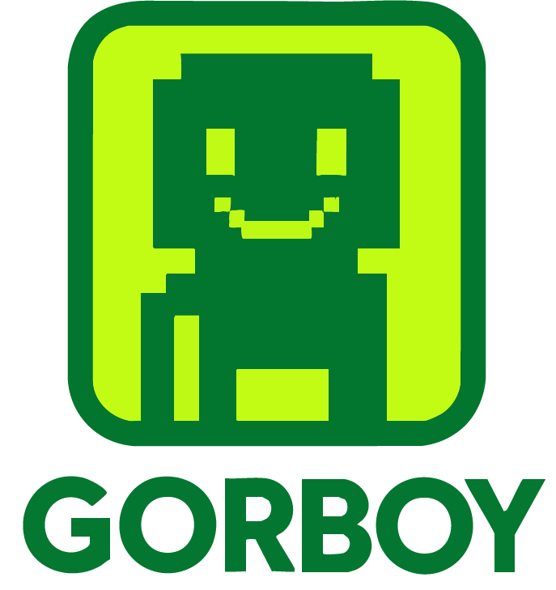

# GORBOY Tokenomics White Paper



**Version 2.0 — Mining & Inflation Model**

---

## Executive Summary

GORBOY introduces a self-regulating token distribution system designed for long-term gaming ecosystems. The model creates value for **two distinct audiences**: game players seeking rewards and token investors seeking appreciation.

### For Game Players

**Why Play GORBOY Games:**
- Earn real tokens through gameplay (not just worthless in-game currency)
- **Early adopters earn 2-3× multipliers** during the growth phase
- Transparent, predictable rewards—no hidden mechanics
- Fun, engaging gameplay with tangible financial upside
- Mining never stops—permanent earning potential

### For Token Investors

**Why Invest in GORBOY:**
- **Natural scarcity model**: 11B mining allocation shrinks over 15 years
- **Independent value growth**: Token price driven by ecosystem adoption, not mining emissions
- **Revenue mechanisms pump value back**: NFT royalties, game purchases, and ecosystem fees flow to token support
- **Deflationary pressure**: Game sinks remove 30-40% of mined tokens from circulation
- **Multi-game platform**: GORBOY becomes the reserve asset as new games launch
- **Long-term appreciation curve**: Scarcity increases while awareness grows

### The Economic Model

- **11 billion GORBOY** allocated exclusively for in-game mining rewards
- **1 billion tokens** available immediately on launch
- **10 billion tokens** released gradually over 15 years (667M per year)
- **Floating exchange rate** adjusts rewards automatically based on pool health
- **Game sinks** return 30-40% of tokens to the pool, extending longevity

**The Result:** Early players earn high yields. Late players earn valuable scarce assets. Investors benefit from organic appreciation as mining supply tightens and ecosystem adoption grows. Mining activity does NOT dilute token value—it drives engagement, which increases demand.

---

## 1. The Dual Value Proposition

GORBOY is designed to create value for **both players and investors** through separate but complementary mechanisms.

### For Players: The Mining Opportunity

**What You Earn:**
- Play games, complete challenges, achieve objectives
- Earn in-game coins that convert to GORBOY tokens
- Conversion rate adjusts based on mining pool size
- Early participation = higher multipliers (up to 3×)

**Example Player Journey:**
- Year 1: Mine 10,000 coins → Earn 15,000 GORBOY (1.5× multiplier)
- Token value: $0.02 each → **Total value: $300**
- Year 5: Mine 10,000 coins → Earn 27,000 GORBOY (2.7× multiplier)
- Token value: $0.50 each → **Total value: $13,500**

Players are incentivized to join early, play actively, and accumulate tokens during the high-yield phase.

### For Investors: The Appreciation Opportunity

**Why GORBOY Value Grows Independently:**

**1. Scarcity Mechanics**
- Mining pool shrinks from 11B → ~1B over 15 years
- Inflation ends completely at year 15
- Zeno's paradox ensures asymptotic decline, never hitting zero
- Supply constraint creates natural upward price pressure

**2. Ecosystem Adoption ≠ Supply Dilution**
- More players = more demand, NOT more supply
- Mining draws from fixed 11B allocation
- Market cap grows with awareness, not emissions
- Gaming activity drives token utility and visibility

**3. Deflationary Game Sinks**
- 30-40% of mined tokens return to pool or burn
- Deaths, failed levels, and purchases remove tokens from circulation
- Net emission rate significantly lower than gross mining rate

**4. Revenue Pumps Value Back**

Multiple revenue streams support token value:

| Revenue Source | Flow | Impact |
|----------------|------|--------|
| **NFT Initial Sales** | → Dev treasury | Funds liquidity, buybacks, marketing |
| **NFT Royalties (2.5%)** | → Dev treasury | Perpetual revenue stream |
| **In-Game Purchases** | → Mining pool or burn | Reduces circulating supply |
| **Platform Fees** | → Ecosystem development | Expands utility and awareness |
| **New Game Launches** | → GORBOY demand | Establishes as reserve asset |

**Example Revenue Model:**
- Launch 2,222 NFTs at 2 SOL each = 4,444 SOL initial raise
- Monthly trading volume: 100 NFTs at avg 3 SOL = 300 SOL
- 2.5% royalty = 7.5 SOL per month = 90 SOL annually
- **Perpetual revenue stream** to support token through buybacks, liquidity, or burns

**5. Multi-Game Platform Effect**
- GORBOY becomes the "Bitcoin" of the ecosystem
- New games launch with their own tokens
- GORBOY maintains legacy premium status
- Cross-game utility increases demand
- Network effects compound over time

### The Investment Thesis

**Traditional Gaming Token Problems:**
- Emissions dilute value ❌
- Play-to-earn creates sell pressure ❌
- No revenue model to support price ❌
- Hype-driven pumps and dumps ❌

**GORBOY Solutions:**
- Fixed 11B mining supply ✓
- Sinks remove 30-40% of emissions ✓
- NFT royalties pump revenue back ✓
- Gradual 15-year appreciation curve ✓

**Price Trajectory (Conceptual):**
- Year 1: $0.01-0.05 (launch, low awareness)
- Year 3: $0.10-0.30 (growing player base)
- Year 7: $0.50-2.00 (mainstream gaming adoption)
- Year 12: $3.00-7.00 (scarcity + mature ecosystem)
- Year 15+: $10+ (post-inflation scarcity asset)

*Note: These are conceptual projections based on model mechanics, not financial advice.*

---

## 2. Token Supply Overview

GORBOY allocates **11 billion tokens** exclusively for in-game mining across all supported games.

**Mining Supply Breakdown:**

| Component | Amount | Purpose |
|-----------|--------|---------|
| **Initial Pool** | 1B GORBOY | Available Day 1 for immediate mining |
| **Inflation Reserve** | 10B GORBOY | Released at 667M/year over 15 years |
| **Total Mining Supply** | 11B GORBOY | Complete lifetime allocation |

**Key Principle:** These tokens exist solely within the gaming ecosystem. They are earned through gameplay, not purchased on exchanges. Market price is determined independently by broader ecosystem adoption, not mining activity.

**For Investors:** This means mining activity does NOT create sell pressure on your holdings. The 11B mining allocation is predictable and transparent. Token value is driven by:
- Ecosystem growth and awareness
- Revenue flowing back to support price
- Natural scarcity as pool depletes
- Multi-game utility expansion

---

## 3. The Floating Exchange Rate

GORBOY uses a dynamic reward system where the exchange rate between in-game coins and GORBOY tokens adjusts in real-time based on the mining pool's current size.

### The Formula

```
GORBOY Earned = (Current Pool Size / 1B Baseline) × In-Game Coins
```

**The multiplier is simply: Current Pool ÷ 1 Billion**

### How It Works

| Current Pool | Multiplier | Example Reward |
|--------------|------------|----------------|
| 3B GORBOY | 3.0× | 100 coins = **300 GORBOY** |
| 2B GORBOY | 2.0× | 100 coins = **200 GORBOY** |
| 1B GORBOY | 1.0× | 100 coins = **100 GORBOY** |
| 500M GORBOY | 0.5× | 100 coins = **50 GORBOY** |
| 100M GORBOY | 0.1× | 100 coins = **10 GORBOY** |

**What this means:**
- When the pool is **full and growing**, players earn **bonus multipliers** (up to 3×)
- When the pool **shrinks**, rewards decrease proportionally
- Rewards **never reach zero** (Zeno's Paradox) but approach it asymptotically

This creates a transparent, predictable system where players always know their expected earnings.

**For Investors:** The floating rate prevents mining from becoming extractive. As token value rises, lower multipliers compensate—players mine fewer tokens but each is worth more. This maintains economic balance between gameplay rewards and token appreciation.

---

## 4. Pool Dynamics: Growth, Peak, and Decline

The mining pool size changes based on three competing flows:

### Three Forces

1. **Inflation (IN):** +667M GORBOY per year for 15 years
2. **Mining (OUT):** Players earn tokens through gameplay
3. **Sinks (IN):** Tokens return via deaths, purchases, fees

### The Lifecycle

**Phase 1: Growth (Years 0-5)**
- Inflation > Mining
- Pool grows from 1B → 3B+
- Reward multipliers increase (1× → 3×)
- Early adopter advantage maximized
- **Investor Impact:** Low token price, high accumulation opportunity

**Phase 2: Peak (Years 5-7)**
- Mining accelerates as player base grows
- Pool reaches maximum size (~3B)
- Highest total rewards available
- **Investor Impact:** Ecosystem awareness grows, price begins sustained climb

**Phase 3: Decline (Years 8-15)**
- Mining > Inflation
- Pool gradually shrinks
- Multipliers decrease but token value rises
- **Investor Impact:** Scarcity drives appreciation, mainstream adoption phase

**Phase 4: Post-Inflation (Year 15+)**
- No new inflation
- Pure mining drain + sinks
- Maximum scarcity, maximum token value
- **Investor Impact:** GORBOY matures into premium digital asset, "Bitcoin of gaming"

---

## 5. Game Sink Mechanics

**Critical component:** Not all mined tokens leave the ecosystem permanently. Game design returns tokens to the pool through various mechanics.

### Sink Categories

| Sink Type | Return Rate | Examples |
|-----------|-------------|----------|
| **Death Penalties** | 50-100% | Player dies, loses unmined coins |
| **In-Game Purchases** | 100% | Buy upgrades, power-ups, cosmetics |
| **PvP Entry Fees** | 80-100% | Tournament entry, battle fees |
| **Level Failures** | 30-50% | Incomplete levels forfeit partial rewards |

**Estimated Total Return:** 30-40% of mined tokens flow back into the pool.

### Why This Matters

**For Players:** Sinks create risk/reward dynamics that make gameplay engaging. Hold your coins for higher multipliers, but risk losing them on death.

**For Investors:** Sinks are deflationary. They reduce net emissions significantly:
- Gross mining: 1B tokens/year (example mid-phase)
- Sinks return: 300-400M tokens/year
- **Net emission: 600-700M tokens/year**

This extends pool longevity while reducing effective supply growth, supporting token value.

---

## 6. Revenue Mechanisms That Support Token Value

Unlike pure play-to-earn models where all value flows OUT to players, GORBOY incorporates multiple revenue streams that flow BACK to support the token ecosystem.

### Revenue Sources

**1. NFT Initial Sales**
- Launch collection: 2,222 NFTs
- Estimated raise: 4,000+ SOL
- **Use:** Initial liquidity, marketing, development, token buyback reserve

**2. NFT Perpetual Royalties**
- 2.5% on all secondary sales
- Monthly trading volume generates ongoing revenue
- **Use:** Recurring buybacks, liquidity provision, ecosystem expansion

**3. In-Game Purchases**
- Cosmetics, power-ups, level unlocks
- Purchased with GORBOY or SOL
- **Use:** If purchased with GORBOY → tokens return to pool or burn (deflationary)
- **Use:** If purchased with SOL → treasury funds token support

**4. Platform Fees (Future)**
- New games launching on infrastructure may pay integration fees
- Revenue share from third-party games
- **Use:** Expand GORBOY utility, increase demand

**5. Strategic Partnerships**
- Gaming guilds, other blockchain projects
- Cross-promotional opportunities
- **Use:** Drive awareness and adoption

### How Revenue Supports Token Price

**Example Monthly Revenue Allocation:**
```
Total Revenue: 15 SOL (from royalties + purchases)

Allocation:
- 40% (6 SOL) → Token buybacks from market
- 30% (4.5 SOL) → Liquidity pool deepening
- 20% (3 SOL) → Marketing and user acquisition
- 10% (1.5 SOL) → Development and expansion
```

**Buyback Effect:**
- 6 SOL per month = 72 SOL annually
- At $100/SOL = $7,200 annual buy pressure
- Compounds over time as ecosystem grows

**This creates a virtuous cycle:**
1. More players → More NFT trading → More royalties
2. More royalties → More buybacks → Higher token price
3. Higher price → More investor interest → More ecosystem attention
4. More attention → More players → **Cycle repeats**

---

## 7. Early Adopter Advantage

The floating exchange rate creates natural incentives to join early.

### Reward Comparison

| Entry Point | Pool Size | Multiplier | 1000 Coins Earned | Token Value | Total Value |
|-------------|-----------|------------|-------------------|-------------|-------------|
| **Year 1** | 1.5B | 1.5× | 1,500 GORBOY | $0.02 | $30 |
| **Year 3** | 2.7B | 2.7× | 2,700 GORBOY | $0.10 | $270 |
| **Year 7** | 2.5B | 2.5× | 2,500 GORBOY | $1.20 | $3,000 |
| **Year 12** | 1.0B | 1.0× | 1,000 GORBOY | $4.50 | $4,500 |
| **Year 15** | 0.8B | 0.8× | 800 GORBOY | $7.50 | $6,000 |

**Key Insight:** Early players earn MORE tokens. Late players earn FEWER tokens but at HIGHER value. Both can profit, but the psychological and actual advantage goes to early adopters.

**For Investors:** Early entry allows accumulation at low prices before ecosystem awareness peaks. As GORBOY transitions from "new gaming token" to "established gaming reserve asset," early positions capture maximum appreciation.

---

## 8. Self-Regulating Economics

The beauty of this model is that it **automatically adjusts** to player behavior without manual intervention.

### Scenario 1: Slow Adoption
- Few players mine
- Pool grows due to inflation
- Multipliers increase
- Higher rewards attract more players

### Scenario 2: Rapid Growth
- Many players mine
- Pool shrinks faster
- Multipliers decrease
- Token scarcity drives value up
- Lower token rewards offset by higher $ value

### Scenario 3: Player Exodus
- Mining activity drops
- Pool stops draining as fast
- Multipliers stabilize or increase
- Remaining players earn more

**The system naturally balances itself** based on supply and demand.

**For Investors:** Self-regulation means the team doesn't need to constantly intervene. The economics are predictable and transparent. No surprise token unlocks, no emergency burns, no panic decisions. The model handles volatility organically.

---

## 9. Long-Term Scarcity and Value

As inflation ends and mining continues, GORBOY transitions from an abundant reward token to a scarce asset.

### The Scarcity Curve

| Year | Pool Size | Annual Mining | Scarcity Level | Expected Value Trend |
|------|-----------|---------------|----------------|---------------------|
| 1-5 | Growing | Low | Abundant | Rising slowly |
| 6-10 | Stable | Moderate | Moderate | Rising steadily |
| 11-15 | Declining | High | Increasing | Rising quickly |
| 15+ | Minimal | Low | Maximum | Mature asset pricing |

**The Inverse Relationship:**

As pool size decreases → Token scarcity increases → Market value rises

This creates a **natural value appreciation curve** independent of mining activity, rewarding long-term holders and making late-stage mining economically viable despite lower token yields.

**For Investors:** This is the Bitcoin parallel. Early miners got 50 BTC per block. Today miners get 6.25 BTC. But each BTC is worth $40K+. The same scarcity-driven appreciation applies to GORBOY as the mining pool depletes and ecosystem adoption grows.

---

## 10. System Visualization

The chart below illustrates the complete 15-year ecosystem behavior:


**Key Observations:**
- Mining pool (brown line) grows during years 0-5 (early adopter phase)
- Pool peaks around year 5 as mining accelerates
- Inflation (orange line) stops at year 10
- Pool gradually drains while price (yellow dashed line) rises steadily
- Clear inverse relationship between supply and value

**For Investors:** This chart shows predictable, gradual appreciation—not a pump-and-dump scheme. The 15-year timeline creates sustainable growth aligned with gaming industry adoption cycles.

---

## 11. Why GORBOY Grows Independently of Mining

**Traditional gaming token problem:**
Mining creates tokens → Players dump tokens → Price crashes → Death spiral

**GORBOY solution:**
Mining draws from fixed pool → Sinks return 30-40% → Revenue buys back tokens → Scarcity increases → Price rises

### The Independence Mechanisms

**1. Separate Allocation**
- Mining: 11B fixed supply (predictable, transparent)
- Market: Ecosystem adoption drives demand (uncorrelated to mining)
- Result: More players ≠ more supply, it means more demand

**2. Deflationary Sinks**
- 30-40% of mined tokens recycled or burned
- Net emission much lower than gross mining
- Effective supply growth slower than ecosystem growth

**3. Revenue Buybacks**
- NFT royalties create perpetual buy pressure
- Compounds as ecosystem scales
- Counteracts any mining sell pressure

**4. Utility Expansion**
- Multi-game platform increases utility
- Cross-game functionality drives holding behavior
- Network effects increase value faster than supply

**5. Investor vs Player Separation**
- Players mine and may sell (but many hold)
- Investors buy and hold for appreciation
- Two distinct markets with different motivations
- Investors absorb player selling during early phases

### Price Support Stack

```
Layer 1: Fixed supply (11B mining allocation)
Layer 2: Deflationary sinks (30-40% return rate)
Layer 3: Revenue buybacks (NFT royalties)
Layer 4: Ecosystem growth (new games, partnerships)
Layer 5: Network effects (more games = more utility)
Layer 6: Scarcity (inflation ends year 15)
```

Each layer supports token value independently. Together they create a robust economic model where mining activity ENHANCES value through engagement rather than DILUTING value through emissions.

---

## 12. Risk Factors and Mitigations

### Potential Risks

**1. Weak Game Sinks**
- Risk: Pool drains too quickly if return rate < 20%
- Mitigation: Design games with meaningful death penalties and compelling in-game purchases
- **Investor note:** Game design is critical to model success

**2. Player Exodus During Decline Phase**
- Risk: Players leave when multipliers drop below 1×
- Mitigation: Token value appreciation compensates for lower yields
- **Investor note:** Long-term value relies on sustained player engagement

**3. Volatility in Early Years**
- Risk: Rapid pool growth/shrinkage creates unpredictable rewards
- Mitigation: Transparent formula allows players to calculate expected earnings at any time
- **Investor note:** Early volatility is expected and factored into model

**4. Post-Inflation Sustainability**
- Risk: After year 15, pool may drain to impractical levels
- Mitigation: New game launches can introduce supplementary token pools; Zeno's paradox ensures mining never fully stops
- **Investor note:** By year 15, GORBOY transitions to reserve asset status with other tokens handling active gameplay

**5. Revenue Model Execution**
- Risk: NFT sales/royalties underperform projections
- Mitigation: Conservative estimates; multiple revenue streams reduce single-point failure
- **Investor note:** Even with 50% lower revenue, buyback mechanisms still support price

---

## 13. Multi-Game Expansion

While this paper focuses on the GORBOY flagship token, the model is designed to support **multiple games and tokens** over time.

### Future Considerations

- **New game launches** may introduce additional token pools
- **Cross-game utility** allows GORBOY to become the "Bitcoin" of the ecosystem
- **Legacy status** as the original token maintains long-term value
- **Platform infrastructure** supports multiple simultaneous mining economies

By year 10+, GORBOY may transition from active mining rewards to a premium store-of-value asset, while newer tokens handle day-to-day gameplay rewards.

**For Investors:** This creates an appreciation runway beyond the 15-year mining model. As the ecosystem expands, GORBOY captures value as the reserve asset—similar to how Bitcoin maintains premium status even as thousands of other cryptocurrencies exist.

---

## Conclusion

GORBOY's tokenomics create value for **two distinct but complementary audiences:**

### For Players:
✓ **High early rewards** with bonus multipliers up to 3×  
✓ **Transparent, predictable** earnings at all times  
✓ **Permanent mining** that never stops (Zeno's paradox)  
✓ **Fun gameplay** with real financial upside  
✓ **Risk/reward** dynamics through game sinks  

### For Investors:
✓ **Natural scarcity** from 15-year inflation decline  
✓ **Independent value growth** uncorrelated to mining emissions  
✓ **Revenue mechanisms** pump value back (NFT royalties, buybacks)  
✓ **Deflationary pressure** from 30-40% game sinks  
✓ **Multi-game platform** effect as ecosystem expands  
✓ **Long-term appreciation** curve aligned with gaming adoption  

**The Unique Value Proposition:**

GORBOY is NOT a typical play-to-earn token where player rewards dilute investor holdings. It's a **sustainable gaming economy** where:
- Player engagement drives ecosystem awareness (good for investors)
- Token scarcity increases over time (good for investors)
- Revenue flows back to support price (good for investors)
- Mining rewards remain viable through value appreciation (good for players)
- Both audiences benefit from ecosystem growth

As GORBOY matures from an abundant reward token to a scarce digital asset, it creates a predictable economic model that aligns incentives across players, investors, and the broader gaming ecosystem.

**This is designed to be a 15+ year journey, not a 6-month pump-and-dump.**

---

**End of White Paper**

*For technical implementation details, game design specifications, NFT collection information, and broader ecosystem token distribution, please refer to supplementary documentation.*

*This document describes a tokenomic model and does not constitute financial advice. Projected price trajectories are conceptual illustrations based on model mechanics, not guarantees of future performance.*
